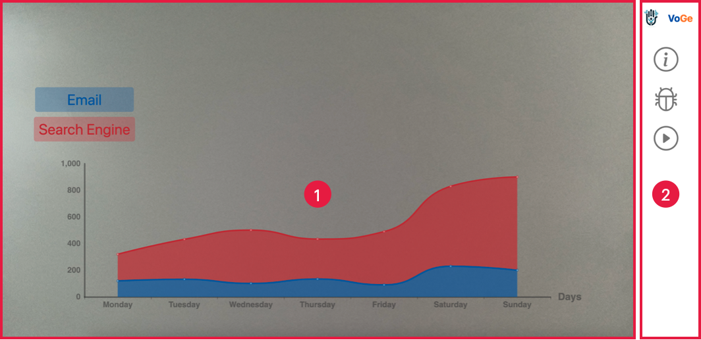

[[toc]]

## Introduction

The `VoGe-Display` is a web application that displays the data charts from the `VoGe-Portal`. Users can use it to make impressive presentations of the data. `VoGe-Display` offers the gesture and voice (multi-modal interaction) control to navigate through the data charts.
Refer to the [Voice Interaction](./Voice%20Interaction.md) and [Gesture Interaction](./Gesture%20Interaction.md) for more details.

* Position 1: The main content: the data visualization chart
* Position 2: The control panel: the `Presentation Timeline`, `Debug Information`, and `Record`

The above figure the webpage of the `VoGe-Display` application. The webpage is divided into two main sections: the left main content is the data visualization chart and the right sidebar is the control panel. The control panel contains the `Presentation Timeline`, `Debug Information`, and `Record`. The `Presentation Timeline` is used to navigate through the data charts, which can be designed in the `VoGe-Portal`. The `Debug Information` is used to display the gesture and voice information. The `Record` is used to record the presentation, it will generate a video file in you local meachine.

## 
