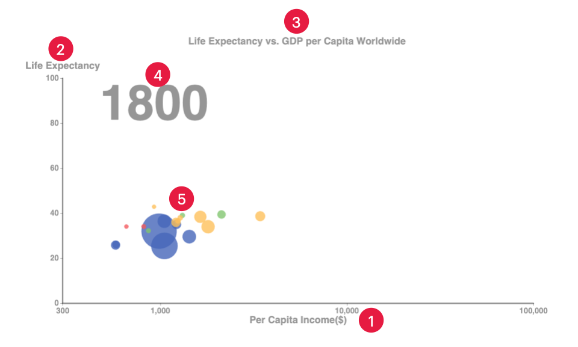

## Bar Chart
## Line Chart
## Animatated Bubble Chart

The animated bubble chart is a chart that shows the change of data over time. It is a scatter plot with the size of the bubbles representing a
 propetry of the data(eg: population, GDP, etc.). The chart is animated to show the change of the data over time. The chart is interactive and the user can control the animation, highlight data elements, and split and reunite data elements, etc.

 The following is an example of an animated bubble chart:
 * Position 1: The X axis
 * Position 2: The Y axis
 * Position 3: The Title
 * Position 4: The Year
 * Position 5: The Data Elements



In the presentation, the user can interact with the chart using voice commands. The following are the voice commands that can be used to interact with the chart:

| Voice Commands          | Description                              | Keywords                | Example                   |
|-------------------------|------------------------------------------|-------------------------|---------------------------|
| Show X-axis             | Display the X-axis on the chart         | Show, X-axis            | "Show X-axis"             |
| Show Y-axis             | Display the Y-axis on the chart         | Show, Y-axis            | "Show Y-axis"             |
| Show Title              | Display the title of the chart          | Show, Title             | "Show Title"              |
| Show Year               | Display the year on the chart           | Show, Year              | "Show Year"               |
| Show Data Elements      | Display all data elements on the chart  | -     | -    |
| Highlight Data Elements | Highlight specific data elements        | - | - |
| Play Animation          | Start the chart animation               | Play, Animation         | "Play Animation"          |
| Stop Animation          | Stop the chart animation                | Stop, Animation         | "Stop Animation"          |
| Rewind                  | Rewind the chart animation              | Backing to [year]       |  Backing to the year of 1900                 |
| Move to                 | Move the animation to a specific point  | Move, Animation         | "Move to [year]"         |
| Animation Speed Faster  | Increase the speed of the animation     | Faster, Animation Speed | "Animation Speed Faster"  |
| Animation Speed Slower  | Decrease the speed of the animation     | Slower, Animation Speed | "Animation Speed Slower"  |
| Split a Data Element    | Separate a data element into parts      | Split, Data Element     | "Split a Data Element"    |
| Reunite a Data Element  | Combine split parts of a data element   | Reunite, Data Element   | "Reunite a Data Element"  |

* Show Data Elements
  
Users can use the data group name or the color of the data group to show the data elements step by step. For example, "Bule is the Asia". The chart will show the data elements of Asia. Users can also use the data group name to show the data elements. For example, "Show the data elements of Asia". It is also supported to show the data elements of multiple data groups. For example, "Show the data elements of Asia and Europe".

* Highlight Data Elements

When the data elements are shown, users can use the data group name or the color of the data group to highlight the data elements. For example, "Highlight the data elements of Asia". The chart will highlight the data elements of Asia. Users can also use the data group name to highlight the data elements. For example, "Highlight the data elements of Asia". It is also supported to highlight the data elements of multiple data groups. For example, "Highlight the data elements of Asia and Europe".

* Stop Animation

When the chart is playing, users can use the voice command "Stop Animation" to stop the chart animation.Users can also add the year to stop the animation at a specific year. For example, "Stop Animation at 2000".

```bash
# Stop Animation Keywords
"pause", "stop", "stop here", "pause here", "stopping", "pausing", "freeze", "holding", "hold"
```

* Rewind

When the chart is playing, users can use the voice command "Rewind" to rewind the chart animation. Users <font color="red">must</font> add the year to rewind the animation to a specific year. For example, "Backing to 1900".

```bash
# Rewind Keywords
"back", "go back", "backing", "rewind", "rewinding", "backing to", "go back to", "back to"
```

* Move to

When the chart is playing, users can use the voice command "Move to" to move the animation to a specific year. Users <font color="red">must</font> add the year to move the animation to a specific year. For example, "Move to 2000".

```bash
# Move to Keywords
"Jump to", "Move to", "Go to", "Move", "Jump", "Go", "Move to the year of", "Jump to the year of", "Go to the year of"
```


