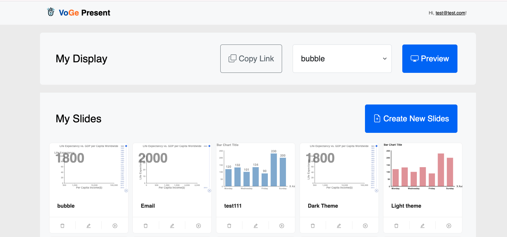
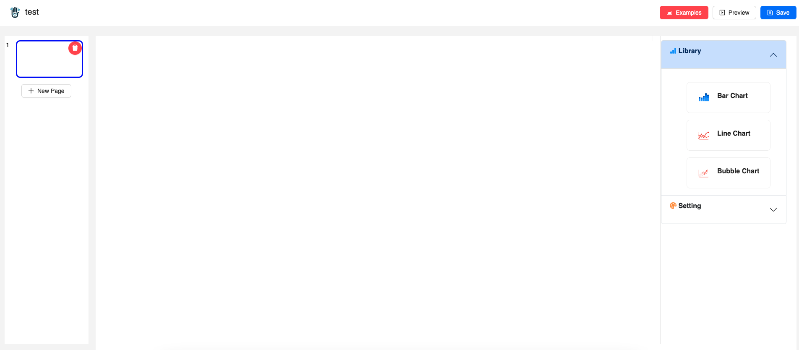
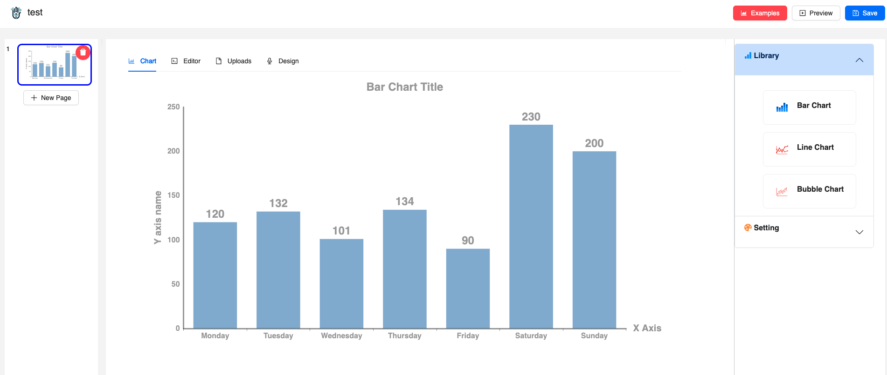

# Create a new slides

If you want to try this on your own local machine, you should install the VoGe project first. Please refer to the [Installation](./Installation.md) page for more information.

After you have installed the VoGe project, you can run the `VoGe-Portal` server and open the web page.

You can create a new slides by following the steps below:

1. Open the `VoGe-Portal` web page.

If have not login in the `VoGe-Portal`, you need to login first.

The test account is:
> account: test@test.com ; password: 123456

After you have logged in, you can see the webapge as follows:

2. You can click the `Create new Slides` button to create a new slides.

In this step, you should input the title the slides, then confirm the title.

3. You can see the new slides in the `My Slides` section.

The new slides is located at the first position in the `My Slides` section, and it is a empty slides. You can click the `Edit` button to edit the slides.

4. You can click the `Edit` button to edit the new slides.

After you have clicked the `Edit` button, you can see the web page as follows:

5. Select a chart type in the right side of the web page.

After you have selected a chart type, you can see the web page as follows:

6. You can click the `Save` button to save the chart or upload new data.

In this step, you can also design the chart style, such as the color, the size, the title, the axis, and so on in the right side of the web page.

> NB: After you design the chart, you should click the `Save` button to save the chart!!!

7. You can click the `Preview` button to preview the chart.